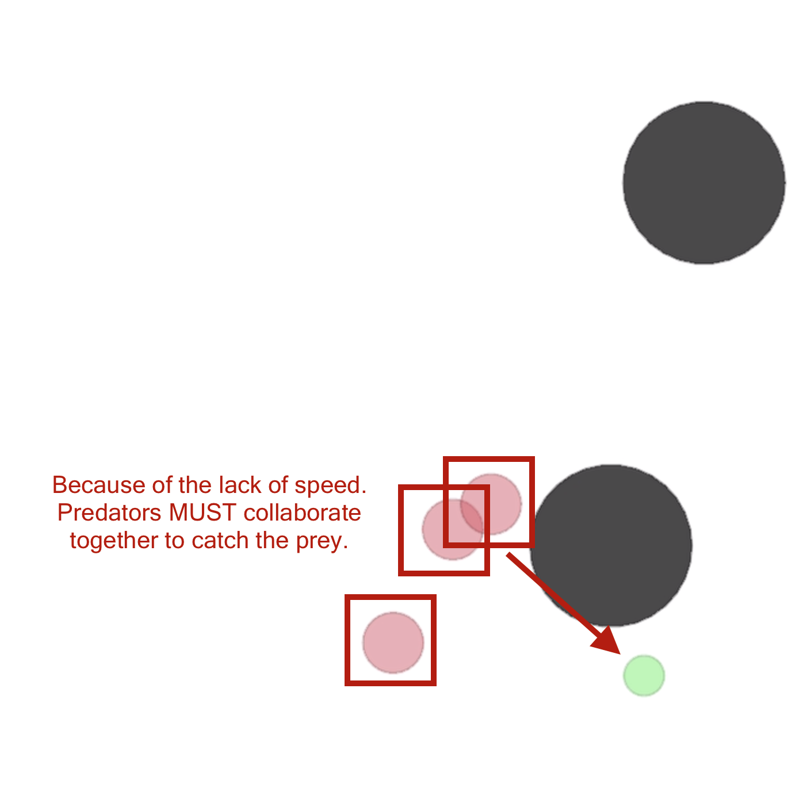

# MADDPG

## Research Paper and environment

[*Multi-Agent Actor-Critic for Mixed Cooperative-Competitive Environments*](https://arxiv.org/abs/1706.02275) (Lowe et. al. 2017)

[*Environment Multi Agent Particle*](https://github.com/openai/multiagent-particle-envs) (Lowe et. al. 2017)

## Train an AI

```
python train.py --scenario simple_speaker_listener
```

## Launch the AI

```
python train.py --scenario simple_speaker_listener --eval --load-episode-saved [episode number]
```

# Cooperative communication

One agent is the ‘speaker’ (gray) that does not move (observes goal of other agent), and other agent is the listener (cannot speak, but must navigate to correct landmark).

### Click on the image to see Cooperative Communication.
<p align="center">
  <a href="https://www.youtube.com/watch?v=qAUf9z0M70M"></a>
</p>

### Click on the image to see Predator-Prey.
<p align="center">
  <a href="https://www.youtube.com/watch?v=sSltKKwCXbM"></a>
</p>
